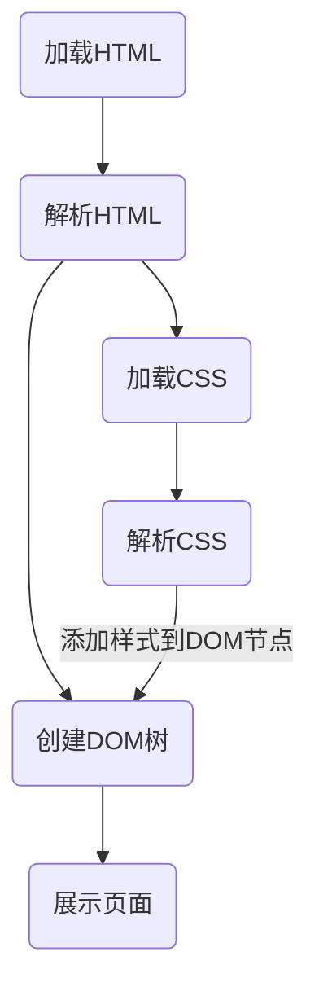

# CSS

## 简介

**CSS** 全称 **$\mathrm{\color{#6eb7fc}C}ascading\;\mathrm{\color{#6eb7fc}S}tyle\;\mathrm{\color{#6eb7fc}S}heets$**，中文名 **层叠样式表**。

## 作用

- 设置字体和颜色
- 设置位置和动画
- 添加动画效果

## 基础语法

```css
h1 /* 选择器 Selector */ {
  color: white; /* 声明 Declaration */
  font-size/* 选择器 Property */: 14px /* 属性值 Value */;
}
```

## 引入方式

```html
<!-- 外链 -->
<link rel="stylesheet" href="./style.css" />

<!-- 嵌入 -->
<style>
  h1 {
    color: white;
  }
</style>

<!-- 内联 -->
<h1 style="color: white;">Hello CSS</h1>
```

## 工作流程



## 选择器 Selector

### 分类

- 按照标签名、类名或 id
- 按照属性
- 按照 DOM 树中的位置

|      选择器      |     用法     |
| :--------------: | :----------: |
|    通配选择器    |     `*`      |
|    标签选择器    |     `h1`     |
|    id 选择器     |    `#id`     |
|     类选择器     |   `.class`   |
|    属性选择器    | `[type="*"]` |
| 伪类选择器(状态) |     `:*`     |
| 伪类选择器(结构) |     `:*`     |

### 组合

|    名称    | 语法  | 说明                                |
| :--------: | :---: | :---------------------------------- |
|  直接组合  |  AB   | 若同时符合 AB，则选中               |
|  后代组合  |  A B  | 若 A 的子孙中存在 B，则选中 B       |
|  亲子后代  | A > B | 若 A 的子元素中存在 B，则选中 B     |
| 兄弟选择器 | A ~ B | 若 A 后方的兄弟元素中有 B，则选中 B |
| 相邻选择器 | A + B | 若 A 后第一个兄弟元素为 B，选中 B   |

### 特异度

| 行内 | id  | (伪)类 | 标签 |
| :--: | :-: | :----: | :--: |
|  1   |  1  |   1    |  1   |
